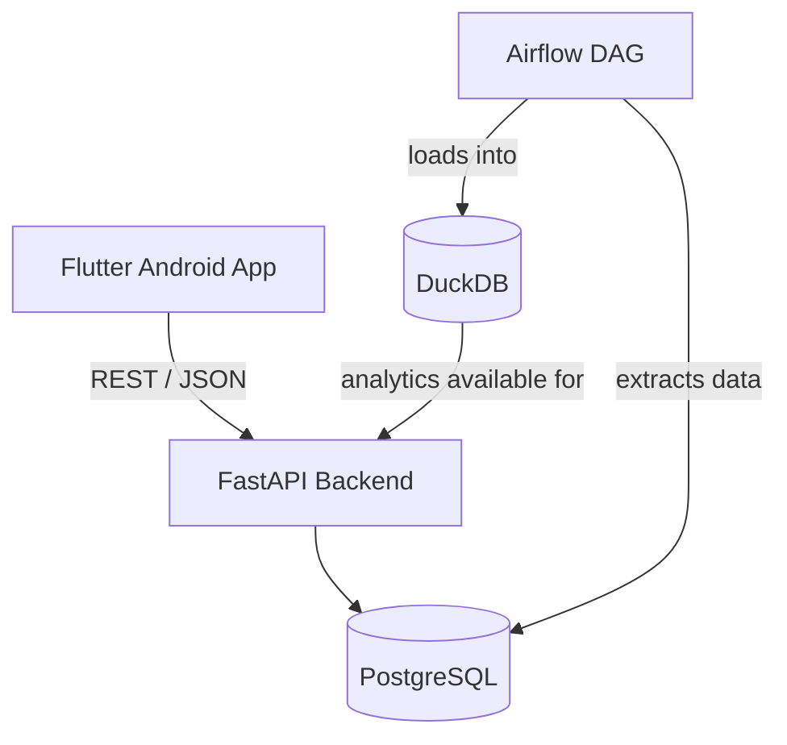
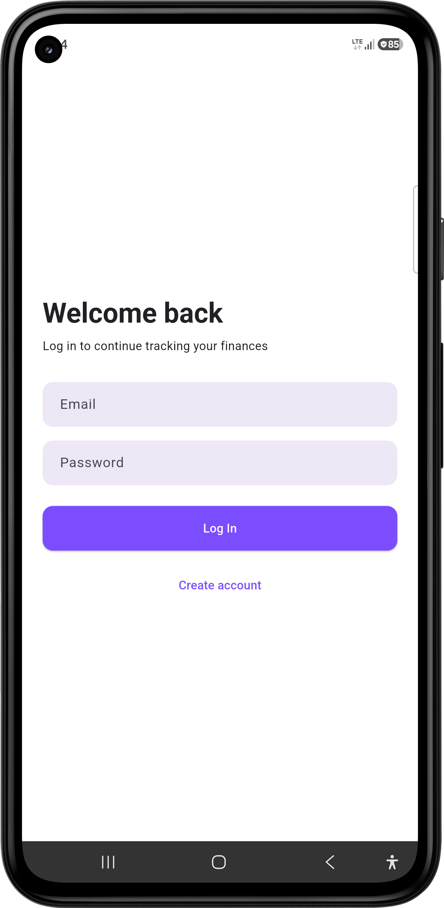
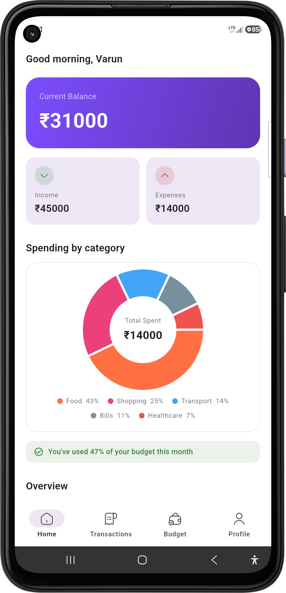
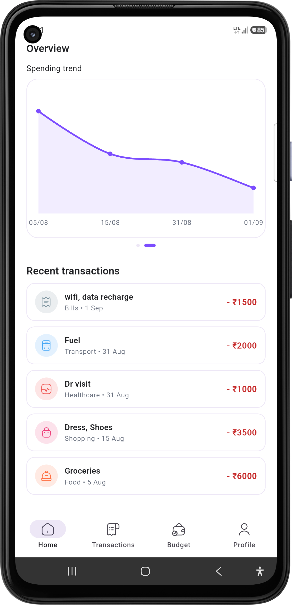
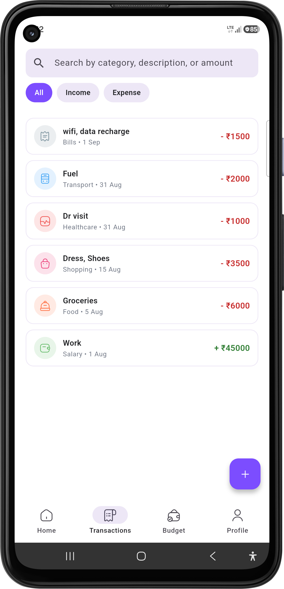
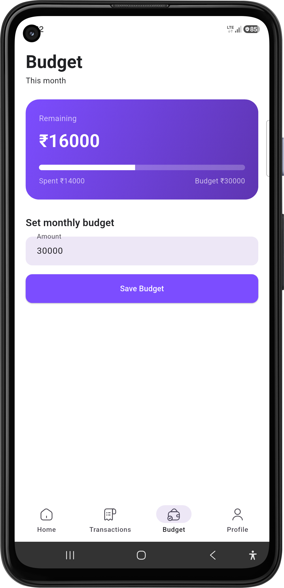

# VeLO - Finance Tracker

A full-stack personal finance tracking application built to demonstrate end-to-end
engineering skills: mobile development, REST API design, authentication, relational
data modeling, analytical querying, and workflow orchestration.

## What it does

Users can register, log in, and track income/expenses across categories. The app shows
a real-time dashboard (balance, income, expenses, spending by category, monthly trends),
supports full transaction CRUD (add/edit/delete/search/filter), and lets users set a
monthly budget with visual progress tracking.

## Architecture

**In plain terms:** Flutter is the Android client. FastAPI exposes a REST API and handles
authentication and business logic. PostgreSQL is the source of truth for all transactional
data. Airflow runs a daily job that extracts transaction data into DuckDB, a lightweight
analytical database optimized for fast aggregate queries - separating heavy analytics work
from the live transactional database.

## Screenshots

  
  
  
  
  

## Technology stack

| Layer | Technology |
|---|---|
| Mobile | Flutter (Android), Riverpod-ready structure, Dio, GoRouter-ready, flutter_secure_storage |
| Backend | FastAPI (Python), SQLAlchemy 2.x, Alembic, Pydantic |
| Primary DB | PostgreSQL 16 |
| Analytics | DuckDB (embedded OLAP) |
| Orchestration | Apache Airflow |
| Auth | JWT (python-jose), bcrypt password hashing (passlib) |
| Infrastructure | Docker Compose |
| Charts | fl_chart (donut, bar, line) |

## Database schema

- **users** - id, email (unique), password_hash, display_name, timestamps
- **categories** - id, name, type (income/expense), icon
- **transactions** - id, user_id (FK), category_id (FK), amount (Numeric), type, description, transaction_date, timestamps
- **budgets** - id, user_id (FK), month, amount, timestamps

Indexes on `transactions.user_id`, `transactions(user_id, transaction_date)`, `budgets.user_id`.
Money fields use `Numeric(12,2)`, not floating point, to avoid rounding errors.

## API overview

| Method | Endpoint | Purpose |
|---|---|---|
| POST | /auth/register | Create account |
| POST | /auth/login | Get JWT access token |
| GET | /auth/me | Current user info (protected) |
| GET/POST/PUT/DELETE | /transactions | Transaction CRUD (protected, user-scoped) |
| GET | /categories | List categories |
| GET | /dashboard/summary | Balance, income, expenses, top category |
| GET | /dashboard/categories | Spending grouped by category |
| GET | /dashboard/monthly | Income/expense totals by month |
| GET/PUT | /budget | Get/set monthly budget |

All protected routes require `Authorization: Bearer <token>` and are scoped to the
authenticated user - a user can never read or modify another user's data, enforced at
the query level (`WHERE user_id = current_user.id`) on every relevant endpoint.

## Authentication flow

1. User registers with email/password → password is hashed with bcrypt, never stored in plain text.
2. User logs in → backend verifies password hash, issues a JWT containing the user's ID (`sub` claim), expiring after a configurable duration.
3. Flutter stores the token in encrypted device storage (`flutter_secure_storage`).
4. Every subsequent API call automatically attaches the token via a Dio interceptor.
5. On app startup, a saved token is verified against `/auth/me` before deciding whether to auto-login or show the login screen.

## DuckDB's role

PostgreSQL remains the single source of truth for transactional data. A separate Python
script (`analytics/extract_to_duckdb.py`) reads all transactions from PostgreSQL and loads
them into a local DuckDB file, refreshed on each run. DuckDB is used because it's
purpose-built for fast analytical (OLAP) queries, keeping heavy aggregation work off the
production transactional database.

## Airflow DAG

A single DAG, `finance_analytics_daily`, runs once a day and calls the DuckDB extraction
script. One well-designed DAG demonstrates workflow orchestration without unnecessary
complexity - this project intentionally avoids over-engineering the analytics pipeline.

## Flutter architecture

- `core/` - theme, network client (Dio + JWT interceptor), reusable constants
- `features/{auth,dashboard,transactions,budgets,profile}/` - one folder per feature, each with its own `presentation/`, `data/`, `models/`
- `shared/widgets/` - reusable UI components (balance card, transaction row, charts, stat chips)

State is managed with simple `StatefulWidget` + `setState` for this project's scope -
kept intentionally straightforward and easy to explain rather than introducing a full
state management library for a project this size.

## Running locally

**Prerequisites:** Docker Desktop, Flutter SDK, Android device/emulator, Python (for local scripts).

1. Clone the repo, copy `.env.example` to `.env`, fill in values.
2. Start backend + database:    `docker compose up -d`

3. Run database migrations (first time only):    `cd backend`     `alembic upgrade head`

4. Seed default categories:    `python ../database/seed_categories.py`

5. Run the Flutter app:    `cd mobile`    `flutter pub get`    `flutter run`

Update `ApiClient.baseUrl` in `mobile/lib/core/network/api_client.dart` to point to your
backend's reachable address (local IP for same-Wi-Fi testing, or a tunnel like **ngrok** for
internet access).

6. (Optional) Start Airflow to see the analytics pipeline:    `docker compose up -d airflow`

Visit `http://localhost:8080` (login: admin/admin), trigger the `finance_analytics_daily` DAG.

## Known limitations

- No automated test suite yet (manually verified via curl and on-device testing throughout development)
- Transaction list filters cover search + income/expense type; category-specific filter chips and date-range filtering are not yet implemented
- Backend currently exposed via ngrok tunnel for development/demo purposes, not a production deployment

## Download

[Download APK](./assets/apk/VeLO.apk)

---
